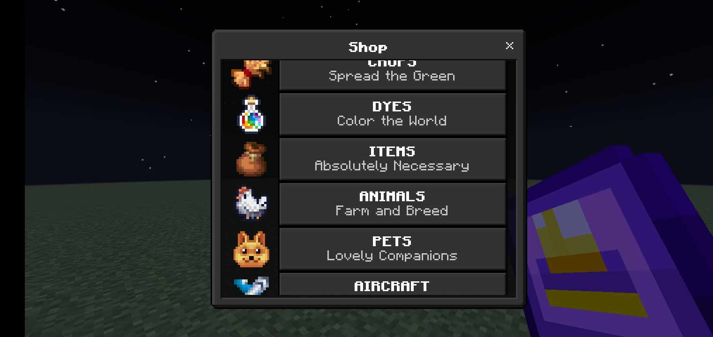
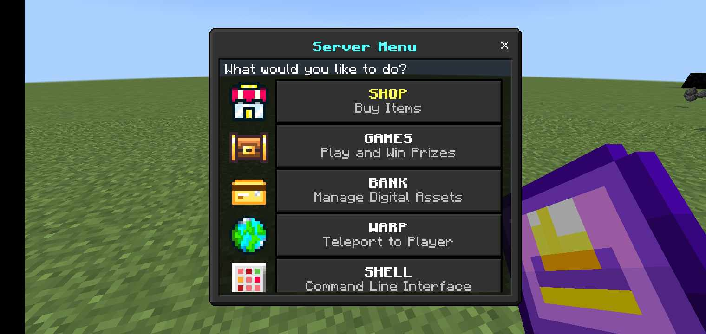

# Bedrock SMP Server Resource and Behavior Packs

This repository contains the source code of the shop I made using the Minecraft: Bedrock Edition official scripting API.

Currently supported versions are 1.20.x and below.

## Screenshots

